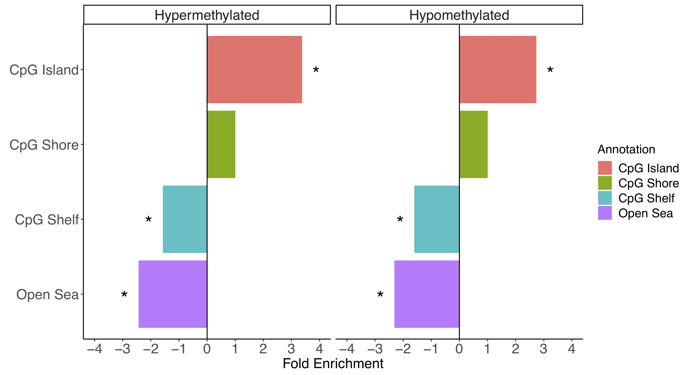
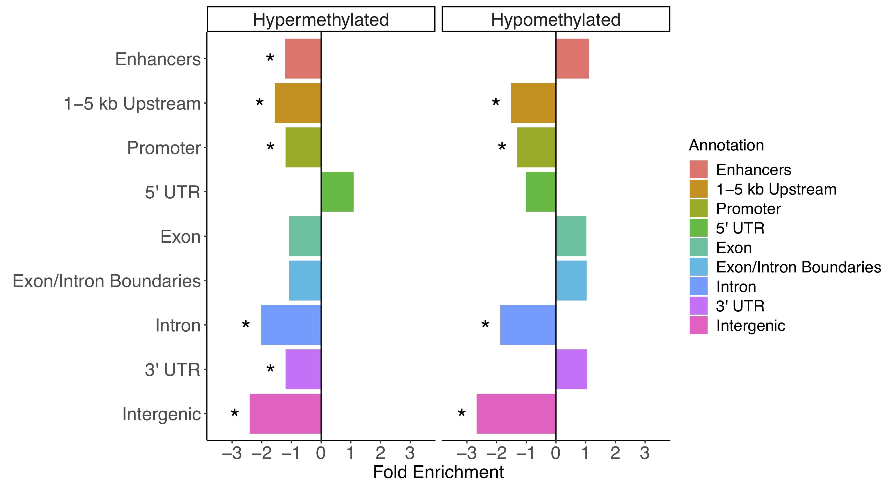

# CGi
#### Takes output from [DMRichR](https://github.com/ben-laufer/DMRichR) and performs statistical testing and visualization for CpG and genic annotation enrichments.

## Overview

This set of scripts utilizes the [Genomic Association Tester](https://gat.readthedocs.io/en/latest/) (GAT) to examine for significant enrichments in CpG (CpG Islands, CpG Shores, CpG Shelves, and Open Sea) and Genic (Enhancers, 1-5 kb Upstream, Promoter, 5' UTR, Exon, Exon/Intron Boundaries, Intron, 3' UTR, and Intergenic) annotations from the [annotatr package](https://bioconductor.org/packages/release/bioc/html/annotatr.html). GAT uses a random sampling based approach that considers sequence length and GC content while also controlling the false discovery rate. The results of the enrichment testing are then visualized in a bar chart. 

## Quick Start
If everything is installed and all the files are in your working directory, the enrichment testing and plotting can be run by the following command: `sh GAT.sh`

## Installation

You can install GAT and bedtools through [conda](https://bioconda.github.io/user/install.html#install-conda): `conda install -c bioconda gat bedtools`

## Enrichment Testing

The working directory for the [shell script](GAT.sh) requires:
1) A bed file of DMRs (DMRs.bed) from DMRichR (Extra > GAT). This file has a fourth column indicating whether the DMR was "hypermethylated" or "hypomethylated". 
2) A bed file of the background regions (background.bed) from DMRichR (Extra > GAT). 
3) A bed file of CpG annotations (hg38_CpG.bed) from DMRichR (Extra > GAT).
4) Bed files of genic annotations (enhancers.bed, promoters.bed, introns.bed, boundaries.bed, intergenic.bed, exons.bed, fiveUTRs.bed, threeUTRs.bed, and onetofivekb.bed) from DMRichR (Extra > GAT).
5) A isochore file that allows you to correct for GC content ([hg38](hg38isochores.bed) is provided in this repository). 

### Background Regions

The background regions provided (in Extra > GAT) are from dmrseq. Alternatively, you can use the bsseq background regions (bsseq_background.csv) from DMRichR (in the Extra folder), where you convert it to bed format by selecting the first three columns and changing the file extension to ".bed" while also making sure to save it with unix line breaks (not windows or mac). The dmrseq and bsseq regions offer very different perspectives, since the dmrseq background regions are defined as the testable regions that show a difference between groups and the DMRs overlap precisely with these background regions, which is ideal for many types of enrichment testing. The bsseq background regions are more representative of genome-wide CpG coverage; however, their size is highly variable and they do not overlap precisely with the DMRs. Therefore, each approach has its own strengths and weaknesses. 

### Other Genomes

These scripts can be modified to work with other genomes, since DMRichR will provide genome specific files if available. However, the lines in the scripts of this repository that refer to hg38 will need to be modified accordingly. The genome specific isochore files can be [downloaded](http://bioinfo2.ugr.es:8080/isochores/maps/) (some will need to be [lifted over](https://genome.ucsc.edu/cgi-bin/hgLiftOver)) and then edited for a [special bed format](https://github.com/AndreasHeger/gat/issues/4) (chr, start, stop, iso). All bed files need to have unix and not mac or windows line breaks.

## Data Visualization

After testing using GAT, the the enrichment results are then visualized by a call to the [R script](GATplots.R).

### CpG Annotations

### Genic Annotations

