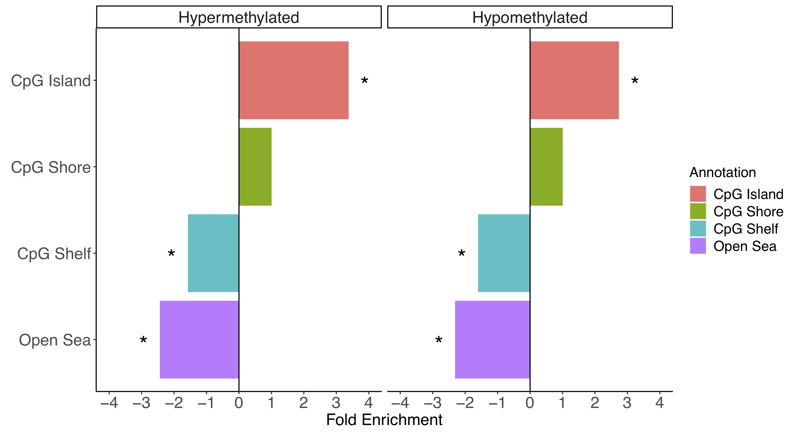

# CGi
#### Takes output from [DMRichR](https://github.com/ben-laufer/DMRichR) and performs statistical testing and visualization for CpG annotation enrichments (CpG Islands, CpG Shores, CpG Shelves, and Open Sea).

## Overview

This set of scripts utilizes the [Genomic Association Tester](https://gat.readthedocs.io/en/latest/) (GAT) to examine for significant enrichments in CpG Islands, CpG Shores, CpG Shelves and Open Sea annotations from the [annotatr package](https://bioconductor.org/packages/release/bioc/html/annotatr.html). GAT uses a random sampling based approach that considers sequence length and GC content while also controlling the false discovery rate. The results of the enrichment testing are then visualized in a bar chart. 

## Installation

You can install GAT through [conda](https://bioconda.github.io/user/install.html#install-conda): `conda install -c bioconda gat`

## Enrichment Testing

The working directory for the [shell script](GAT_CpG_hyper_hypo.sh) requires:
1) A bed file of DMRs (DMRs.bed) from DMRichR (Extra > GAT). This file has a fourth column indicating whether the DMR was "hypermethylated" or "hypomethylated". 
2) A bed file of background regions (background.bed) from DMRichR (Extra > GAT).
3) A bed file of CpG annotations (hg38_CpG.bed) from DMRichR (Extra > GAT).
4) A isochore file that allows you to correct for GC content ([hg38](hg38isochores_sorted.bed) is provided in this repository). 

Note: These scripts can be modified to work with other genomes. The lines in the scripts that refer to hg38 will need to be modified accordingly. The isochore files can be [downloaded](http://bioinfo2.ugr.es:8080/isochores/maps/) (some will need to be [lifted over](https://genome.ucsc.edu/cgi-bin/hgLiftOver)) and then edited for a [special bed format](https://github.com/AndreasHeger/gat/issues/4) (chr, start, stop, iso). All bed files need to have unix and not mac or windows line breaks.

## Data Visualization

Then the enrichment results can be visualized using the [R script](GAT_CpG_hyper_hypo_plot.R).

